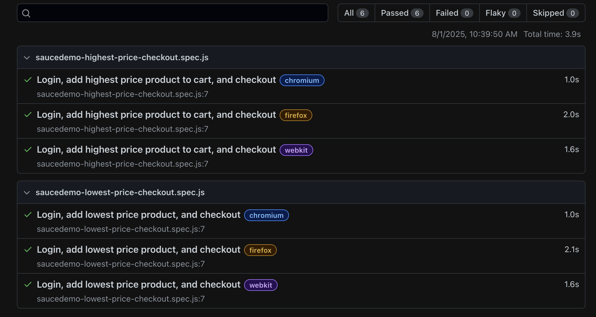
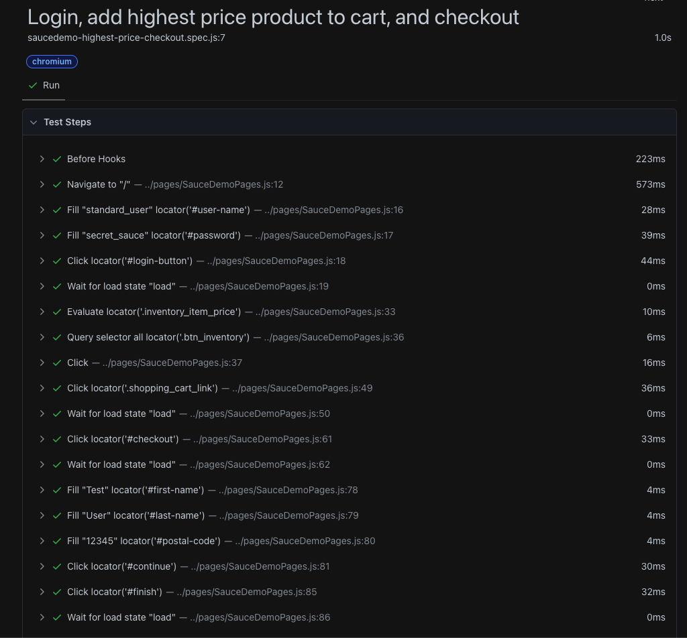

- Now open the copilot chat
- Make sure MPC Server is running
- Attach the `context.txt`
- Then put the individual test case's prompt, for example 

## Test Results Summary


## Test Results Details


## Playwright with GitHub Copilot and MCP Server


### Prerequisite   
- VSCode
- GitHub Copilot VSCode Extension
- GitHub Account (To Active Copilot)
- Playwright [Installed](https://playwright.dev/docs/intro#installing-playwright)
- Playwright Test for VSCode Extension (optional)

### Install Playwright [MCP](https://github.com/microsoft/playwright-mcp) Server
### Verify Playwright MCP Installed
- Open Copilot Chat
- Click on the settings icon


### Generate Test Cases
- Write a common prompt (context) in a `.txt` file and keep it anywhere in the project, for example:

```
- Generates Playwright test code for a web application.
- Follows the Page Object Model (POM) design pattern, storing page objects in a pages directory.
- Places the generated test cases in a tests directory.
- Executes the tests after generation.
- Analyzes and debugs failed tests, fixing the code.
- Repeats the process until the tests pass.
```

- Now open the copilot chat
- Make sure MPC Server is running
- Attach the `context.txt`
- Then put the individual test case's prompt, for example 

```
1. Go to https://www.saucedemo.com/
2. Login by using existing credentials 
3. Add lowest price product to cart
4. Checkout 
```

## The Output

Page.js
```javascript
const { expect } = require('@playwright/test');

class LoginPage {
  constructor(page) {
    this.page = page;
    this.usernameInput = '#user-name';
    this.passwordInput = '#password';
    this.loginButton = '#login-button';
  }

  async goto() {
    await this.page.goto('https://www.saucedemo.com/');
  }

  async login(username, password) {
    await this.page.fill(this.usernameInput, username);
    await this.page.fill(this.passwordInput, password);
    await this.page.click(this.loginButton);
    await this.page.waitForURL('https://www.saucedemo.com/inventory.html');
  }
}

class InventoryPage {
  constructor(page) {
    this.page = page;
    this.priceSelector = '.inventory_item_price';
    this.addButtonSelector = '.btn_inventory';
    this.cartLink = '.shopping_cart_link';
  }

  async addLowestPriceProduct() {
    const prices = await this.page.$$eval(this.priceSelector, els => els.map(e => parseFloat(e.textContent.replace('$', ''))));
    const minPrice = Math.min(...prices);
    const minIndex = prices.indexOf(minPrice);
    const addButtons = await this.page.$$(this.addButtonSelector);
    await addButtons[minIndex].click();
  }

  async goToCart() {
    await this.page.click(this.cartLink);
    await this.page.waitForURL('https://www.saucedemo.com/cart.html');
  }
}

class CartPage {
  constructor(page) {
    this.page = page;
    this.checkoutButton = '#checkout';
  }

  async checkout() {
    await this.page.click(this.checkoutButton);
    await this.page.waitForURL('https://www.saucedemo.com/checkout-step-one.html');
  }
}

class CheckoutPage {
  constructor(page) {
    this.page = page;
    this.firstNameInput = '#first-name';
    this.lastNameInput = '#last-name';
    this.postalCodeInput = '#postal-code';
    this.continueButton = '#continue';
    this.finishButton = '#finish';
    this.completeHeader = '.complete-header';
  }

  async fillInfo(firstName, lastName, postalCode) {
    await this.page.fill(this.firstNameInput, firstName);
    await this.page.fill(this.lastNameInput, lastName);
    await this.page.fill(this.postalCodeInput, postalCode);
    await this.page.click(this.continueButton);
  }

  async finishCheckout() {
    await this.page.click(this.finishButton);
    await this.page.waitForURL('https://www.saucedemo.com/checkout-complete.html');
  }

  async verifyOrderComplete() {
    await this.page.waitForSelector(this.completeHeader);
    await expect(this.page.locator(this.completeHeader)).toHaveText('Thank you for your order!');
  }
}

module.exports = { LoginPage, InventoryPage, CartPage, CheckoutPage };

```
test.spec.js
```javascript
const { test, expect } = require('@playwright/test');
const { LoginPage, InventoryPage, CartPage, CheckoutPage } = require('../pages/SauceDemoPages');

const USERNAME = 'standard_user';
const PASSWORD = 'secret_sauce';

test('Login, add lowest price product, and checkout', async ({ page }) => {
  const loginPage = new LoginPage(page);
  const inventoryPage = new InventoryPage(page);
  const cartPage = new CartPage(page);
  const checkoutPage = new CheckoutPage(page);

  await loginPage.goto();
  await loginPage.login(USERNAME, PASSWORD);
  await inventoryPage.addLowestPriceProduct();
  await inventoryPage.goToCart();
  await cartPage.checkout();
  await checkoutPage.fillInfo('Test', 'User', '12345');
  await checkoutPage.finishCheckout();
  await checkoutPage.verifyOrderComplete();
});
```

## Test Results
### Summary


### Details


